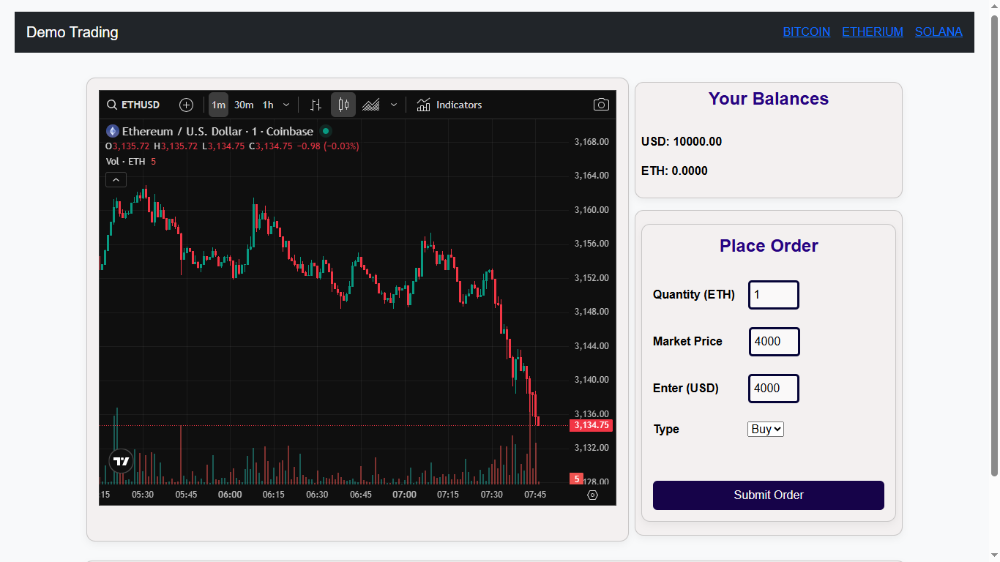
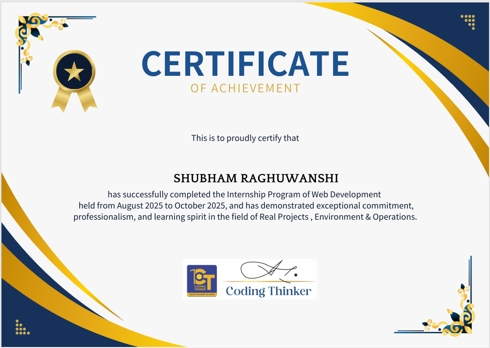

# 👨‍💻 Shubham Raghuwanshi  
###  Full Stack Fresher

---

## 🚀 About Me
I am a highly motivated and enthusiastic **Full Stack Developer** specializing in the **MERN stack (MongoDB, Express.js, React.js, Node.js)**.  
As a fresher, I have a strong foundation in building **scalable, responsive, and robust web applications**.  
I enjoy solving technical challenges and continuously improving my skills to deliver high-quality code and great user experiences.

---

## 🎓 Education

**Bachelor of Computer Science**  
📍 RGPV University  
📆 2022 – 2026
- No backlogs in any semester

**Higher Secondary (PCMB)**  
📍 MP Board  
📆 2018 – 2021  
- 12th: 60%  
- 10th: 71%  

---

## 💼 Project Experience

### 🔹 Crypto Demo Trading Website *(Minor Project)*
- Built a demo trading platform with **real-time cryptocurrency price updates**
- Integrated **JavaScript APIs** and **TradingView widgets**
- Focused on UI responsiveness and real-time data handling

**Tech Used:**  
`HTML` `CSS` `JavaScript` `API Integration`

---

### 🔹 Food Donation Website *(Major Project – Full Stack)*
- Users can add food donation details
- NGOs can apply for available food
- Admin has full **CRUD access** over users and NGOs
- Implemented role-based access and backend logic

**Tech Used:**  
`React.js` `Node.js` `Express.js` `MongoDB` `Bootstrap`

---

## 🛠️ Skills

### Frontend
- HTML  
- CSS  
- JavaScript  
- React.js  
- Bootstrap  
- Tailwind CSS  

### Backend
- Node.js  
- Express.js  

### Database
- MongoDB  
- MySQL  

### Tools & Other
- Git & GitHub  
- Postman  
- Blockchain (Basic Knowledge)

---

## 💼 Achievement

### 🔹 Inernship certificate in MERN stack*

## 🔗 Profiles & Links
- **GitHub:** [https://github.com/Tech-Shubham11](https://github.com/Tech-Shubham11)
- **LinkedIn:** [https://www.linkedin.com/in/shubham-raghuwanshi11a](https://www.linkedin.com/in/shubham-raghuwanshi11a)

---

## 📞 Contact Information
- 📱 Phone: 6263869917  
- 📧 Email: shubhamraghuwanshi3556@gmail.com  
- 📍 Location: Marimata Square, Indore, India

---

## ⭐ Future Goals
- Master advanced MERN concepts
- Learn system design & scalable architecture
- Contribute in Real world projects
- Grow as a professional full-stack developer

---
